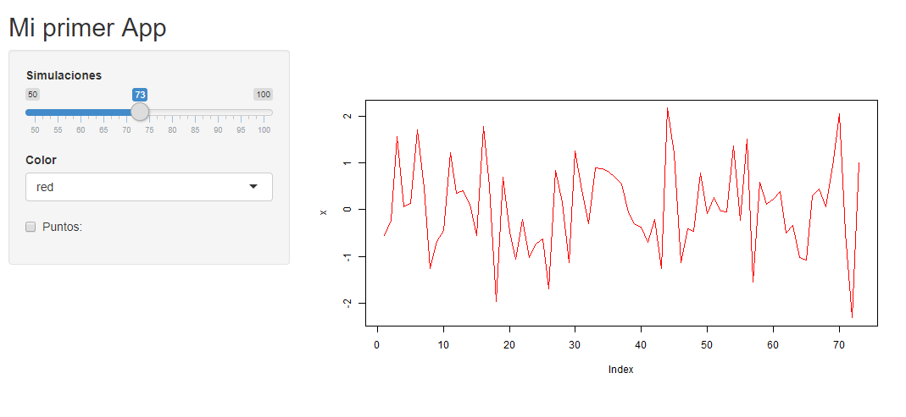
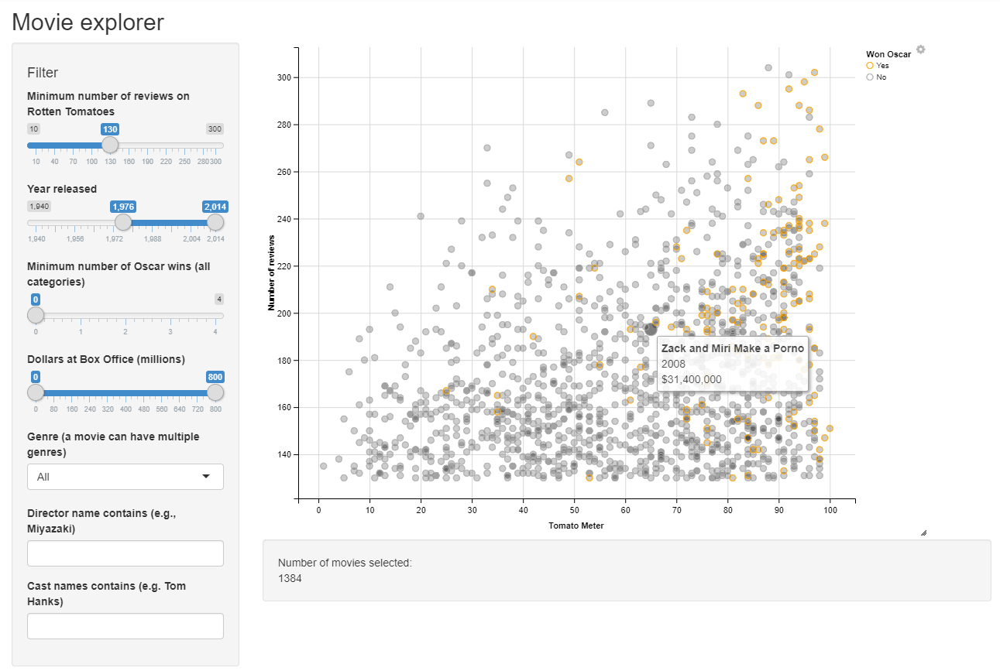
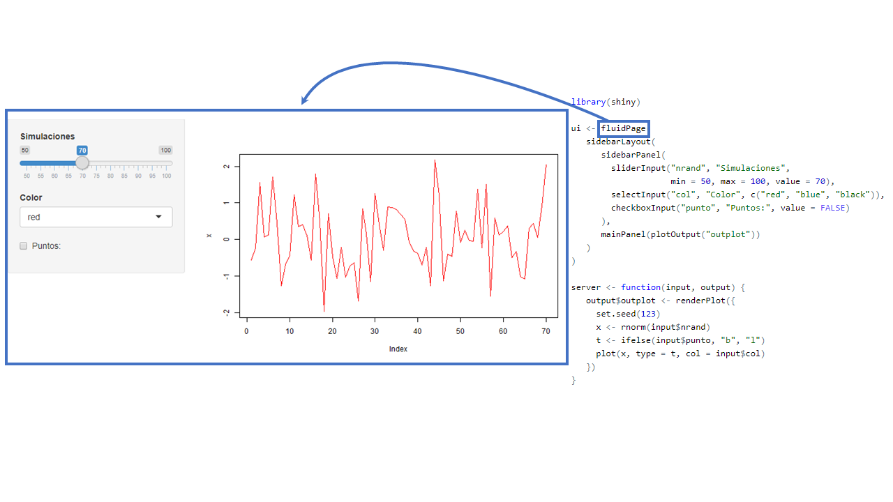
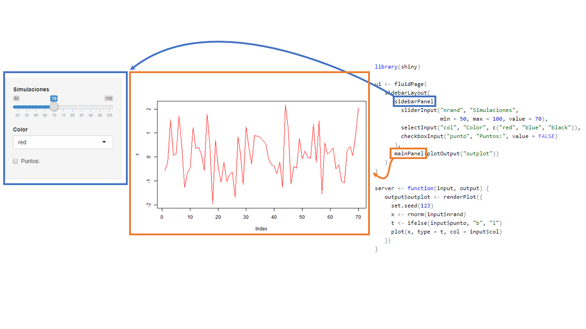
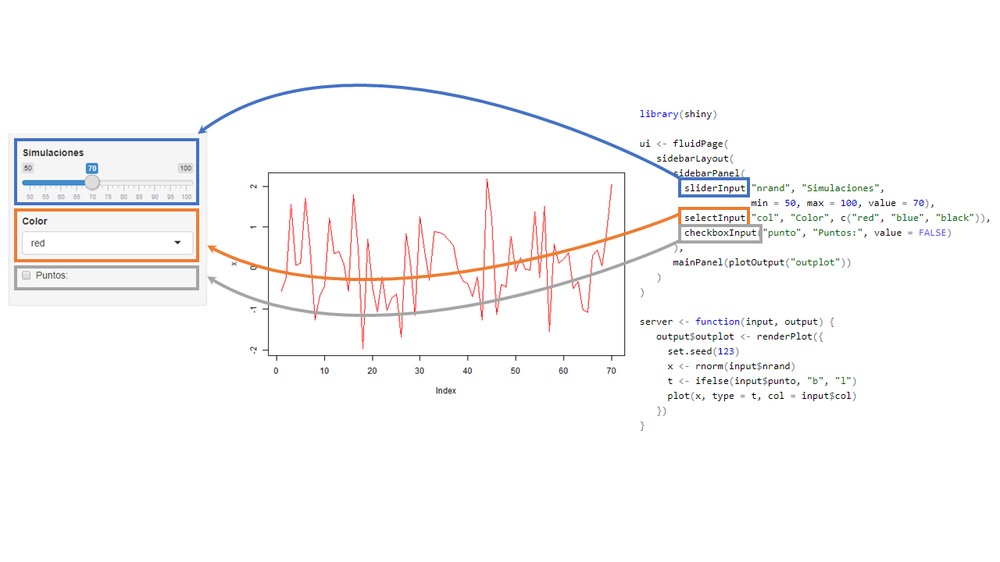
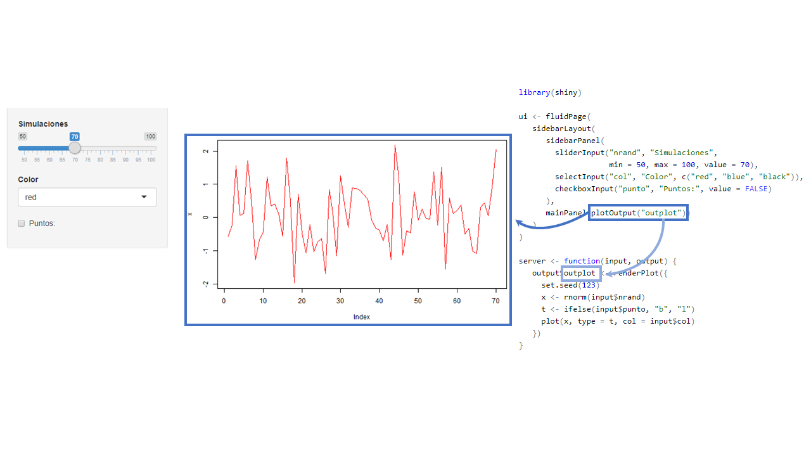
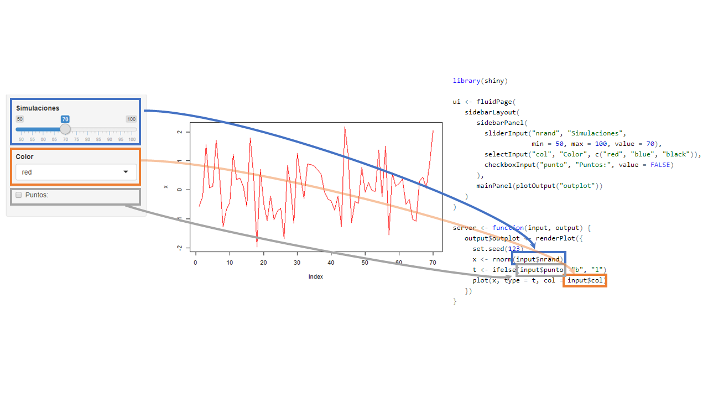
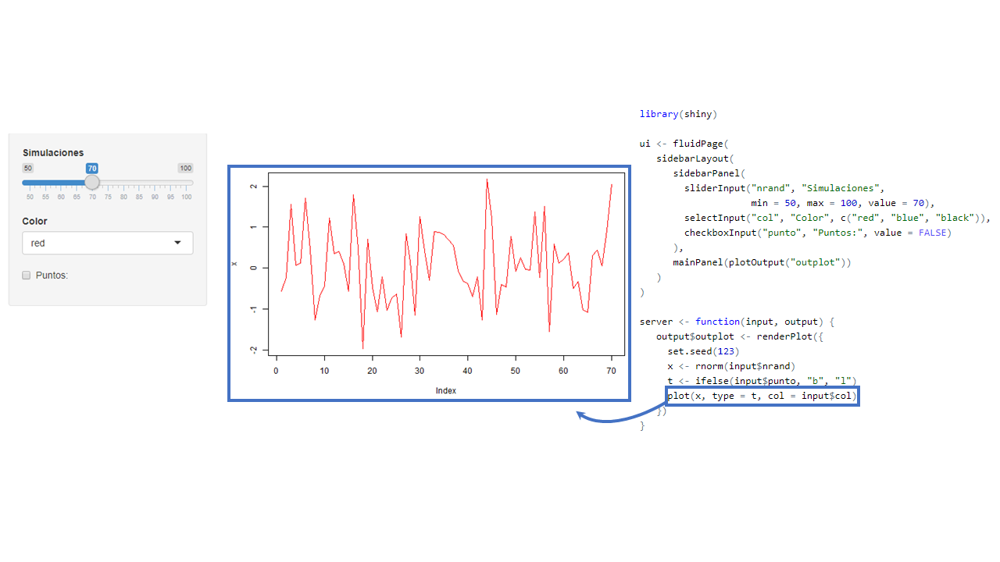

```{r setup, include=FALSE}
options(htmltools.dir.version = FALSE)
```

class: center, middle, inverse

# Antes de Partir

---

# Supuestos

Asumimos que tenemos conocimiento de como funciona R, paquetes, funciones, etc.


No es necesario en `shiny` pero usaremos los paquetes `dplyr` y `ggplot` principalmente
para hacer manipulación y visualización de los datos


Necesitaremos algunos paquetes: 


```{r, eval=FALSE}
install.packages(
  c("tidyverse", "shiny", "shinythemes", "shinyWidgets",
    "shinydashboard", "DT", "leaflet", "plotly")
  )
```


---

# Ayuda


No olvidar que una buena forma de aprender es con la documentación oficial:


https://shiny.rstudio.com/tutorial/

https://shiny.rstudio.com/tutorial/written-tutorial/lesson1/

https://github.com/rstudio/cheatsheets/raw/master/shiny.pdf

https://github.com/rstudio/cheatsheets/raw/master/translations/spanish/shiny_Spanish.pdf


---

class: center, middle, inverse

# ¿Qué es una __app__(licación) web?

---

# Aplicación Web

(Wikipedia:) Herramientas que los usuarios pueden utilizar accediendo 
a un servidor web a través de internet o de una intranet mediante un navegador.





---

# Aplicación Web

App con mas `input`s y `output`s




---

# La estructura de una ShinyApp

<br>

```{r, eval=FALSE}
library(shiny)

ui <- fluidPage()

server <- function(input, output) {}

runApp(list(ui = ui, server = server)) 
```


---

# La estructura de una ShinyApp

<br>


```{r, eval=FALSE}
library(shiny)

ui <- fluidPage()                            #<<

server <- function(input, output) {}

runApp(list(ui = ui, server = server)) 
```


<br>

- Se define una interfaz de usuario (user interface). En adelante `ui`
- En este caso es una página fluida vacía `fluidPage()`
- En el futuro acá definiremos diseño/estructura de nuestra aplicación (_layout_).
Que se refiere la disposición de nuestros `inputs` y `outputs`


---

# La estructura de una ShinyApp

<br>

```{r, eval=FALSE}
library(shiny)

ui <- fluidPage()                            

server <- function(input, output) {}         #<<

runApp(list(ui = ui, server = server)) 
```

<br>

- Se define el `server` en donde estará toda la lógica de nuestra aplicación.
- Principalmente serán instrucciones que dependeran de `inputs` 


---

# La estructura de una ShinyApp

<br>

```{r, eval=FALSE}
library(shiny)

ui <- fluidPage()                            

server <- function(input, output) {}         

runApp(list(ui = ui, server = server))       #<<
```

<br>

- `runApp` es la funcion que crea y deja corriendo la app con los 
parámetros otorgados.
- **No siempre** tendremos que escribirla pues veremos que RStudio
al crear una shinyApp nos pondrá un botón para _servir_ la aplicación


---

class: center, middle, inverse

# Ejercicio #1

---

# Nuestra primer App andando

Hacer funcionar el siguiente `código` en R Rstudio: (hint: sí, copy + paste + run) 

```{r, eval=FALSE}
ui <- fluidPage(
   sidebarLayout(
      sidebarPanel(
        sliderInput("nrand", "Simulaciones",
                    min = 50, max = 100, value = 70),
        selectInput("col", "Color", c("red", "blue", "black")),
        checkboxInput("punto", "Puntos:", value = FALSE)
      ),
      mainPanel(plotOutput("outplot"))
   )
)

server <- function(input, output) {
   output$outplot <- renderPlot({
     set.seed(123)
     x <- rnorm(input$nrand)
     t <- ifelse(input$punto, "b", "l")
     plot(x, type = t, col = input$col)
   })
}
```

---

class: center, middle, inverse

# Funcionamiento de una app de Shiny

---

# App


---

# Contenedor 



---

# Otros contenedores 



---

# Inputs 



---

# Outputs



---

# Interacción 



---

# Resultado



---

# La estructura de una ShinyApp 2


.code60[
```{r, eval=FALSE}
ui <- fluidPage(
   sidebarLayout(
      sidebarPanel(
        sliderInput("nrand", "Simulaciones",
                    min = 50, max = 100, value = 70),
        selectInput("col", "Color", c("red", "blue", "black")),
        checkboxInput("punto", "Puntos:", value = FALSE)
      ),
      mainPanel(plotOutput("outplot"))
   )
)

server <- function(input, output) {
   output$outplot <- renderPlot({
     set.seed(123)
     x <- rnorm(input$nrand)
     t <- ifelse(input$punto, "b", "l")
     plot(x, type = t, col = input$col)
   })
}
```
]

---

# La estructura de una ShinyApp 2

.code60[
```{r, eval=FALSE}
ui <- fluidPage(                                                  #<<                                        
   sidebarLayout(                                                 #<<
      sidebarPanel(                                               #<<
        sliderInput("nrand", "Simulaciones",                       
                    min = 50, max = 100, value = 70),
        selectInput("col", "Color", c("red", "blue", "black")),
        checkboxInput("punto", "Puntos:", value = FALSE)
      ),
      mainPanel(plotOutput("outplot"))                            #<<
   )
)

server <- function(input, output) {
   output$outplot <- renderPlot({
     set.seed(123)
     x <- rnorm(input$nrand)
     t <- ifelse(input$punto, "b", "l")
     plot(x, type = t, col = input$col)
   })
}
``` 
]

- `fluidPage`, `sidebarLayout`, `sidebarPanel`, `mainPanel` definen el diseño/_layout_ de nuestra
app
-  Existen muchas más formas de organizar una app: Por ejemplo uso de _tabs_ de _menus_, o páginas
con navegación. Más detalles http://shiny.rstudio.com/articles/layout-guide.html


---

# La estructura de una ShinyApp 2

.code60[
```{r, eval=FALSE}
ui <- fluidPage(                                                                                          
   sidebarLayout(                                                 
      sidebarPanel(                                               
        sliderInput("nrand", "Simulaciones",                      #<< 
                    min = 50, max = 100, value = 70),             #<<
        selectInput("col", "Color", c("red", "blue", "black")),   #<<
        checkboxInput("punto", "Puntos:", value = FALSE)          #<<
      ),
      mainPanel(plotOutput("outplot"))                            
   )
)

server <- function(input, output) {
   output$outplot <- renderPlot({
     set.seed(123)
     x <- rnorm(input$nrand)
     t <- ifelse(input$punto, "b", "l")
     plot(x, type = t, col = input$col)
   })
}
``` 
]

- `sliderInput`, `selectInput`, `checkboxInput` son los inputs de nuestra app,
con esto el usuario puede interactuar con nuestra aplicación
- Estas funciones generan el input deseado en la app y shiny perminte que los
valores de estos inputs sean usados como valores usuales en R en la parte del server
(numericos, strings, booleanos, fechas)

---

# La estructura de una ShinyApp 2

.code60[
```{r, eval=FALSE}
ui <- fluidPage(                                                                                          
   sidebarLayout(                                                 
      sidebarPanel(                                               
        sliderInput("nrand", "Simulaciones",                       
                    min = 50, max = 100, value = 70),             
        selectInput("col", "Color", c("red", "blue", "black")),   
        checkboxInput("punto", "Puntos:", value = FALSE)          
      ),
      mainPanel(plotOutput("outplot"))                            #<<                       
   )
)

server <- function(input, output) {
   output$outplot <- renderPlot({
     set.seed(123)
     x <- rnorm(input$nrand)
     t <- ifelse(input$punto, "b", "l")
     plot(x, type = t, col = input$col)
   })
}
``` 
]

- `plotOutput` define el lugar donde la salida estará
- Como mencionamos, nuestras app ueden tener muchos outputs: tablas, texto, imágenes


---

# La estructura de una ShinyApp 2

.code60[
```{r, eval=FALSE}
ui <- fluidPage(                                                                                          
   sidebarLayout(                                                 
      sidebarPanel(                                               
        sliderInput("nrand", "Simulaciones",                       
                    min = 50, max = 100, value = 70),             
        selectInput("col", "Color", c("red", "blue", "black")),   
        checkboxInput("punto", "Puntos:", value = FALSE)          
      ),
      mainPanel(plotOutput("outplot"))                                                   
   )
)

server <- function(input, output) {
   output$outplot <- renderPlot({                               #<<
     set.seed(123)
     x <- rnorm(input$nrand)
     t <- ifelse(input$punto, "b", "l")
     plot(x, type = t, col = input$col)
   })
}
``` 
]

- `renderPlot` define un tipo de salida gráfica
- Existen otros tipos de salidas, como tablas `tableOutput` o tablas más interactivas como 
`DT::DTOutput`


---

# La estructura de una ShinyApp 2

.code60[
```{r, eval=FALSE}
ui <- fluidPage(                                                                                          
   sidebarLayout(                                                 
      sidebarPanel(                                               
        sliderInput("nrand", "Simulaciones",                       
                    min = 50, max = 100, value = 70),             
        selectInput("col", "Color", c("red", "blue", "black")),   
        checkboxInput("punto", "Puntos:", value = FALSE)          
      ),
      mainPanel(plotOutput("outplot"))                                                   
   )
)

server <- function(input, output) {
   output$outplot <- renderPlot({                               
     set.seed(123)                                              #<<
     x <- rnorm(input$nrand)                                    #<<
     t <- ifelse(input$punto, "b", "l")                         #<<
     plot(x, type = t, col = input$col)                         #<<
   })
}
``` 
]

- Este espacio determina la lógica de nuestra salida 
- Acá haremos uso de los inputs para entregar lo que deseamos


---

class: center, middle, inverse

# Interacción entre inputs y outputs

---

# La estructura de una ShinyApp 2

.code60[
<pre class="r hljs remark-code">
ui <- fluidPage(                                                                                          
   sidebarLayout(                                                 
      sidebarPanel(                                               
        sliderInput("nrand", "Simulaciones",                       
                    min = 50, max = 100, value = 70),             
        selectInput("col", "Color", c("red", "blue", "black")),   
        checkboxInput("punto", "Puntos:", value = FALSE)          
      ),
      mainPanel(<b>plotOutput</b>("outplot"))
   )
)

server <- function(input, output) {
   output$outplot <- <b>renderPlot</b>({                               
     set.seed(123)                                              
     x <- rnorm(input$nrand)                                    
     t <- ifelse(input$punto, "b", "l")                         
     plot(x, type = t, col = input$col)                         
   })
}
</pre>
]

- Las funciones `*Output()` y `render*()`  trabajan juntas para agregar salidas de R a la
interfaz de usuario
- En este caso `renderPlot` esta asociado con `plotOutput` (¿cómo?)
- Hay muchas parejas como `renderText`/`textOutput` o `renderTable`/`tableOutput` entre
otras (revisar la sección de outputs en el cheat sheet)
 
 
---

# La estructura de una ShinyApp 2

.code60[
<pre class="r hljs remark-code">
ui <- fluidPage(                                                                                          
   sidebarLayout(                                                 
      sidebarPanel(                                               
        sliderInput("nrand", "Simulaciones",                       
                    min = 50, max = 100, value = 70),             
        selectInput("col", "Color", c("red", "blue", "black")),   
        checkboxInput("punto", "Puntos:", value = FALSE)          
      ),
      mainPanel(plotOutput(<b>"outplot"</b>))
   )
)

server <- function(input, output) {
   output$<b>outplot</b> <- renderPlot({                               
     set.seed(123)                                              
     x <- rnorm(input$nrand)                                    
     t <- ifelse(input$punto, "b", "l")                         
     plot(x, type = t, col = input$col)                         
   })
}
</pre>
]

- Cada `*Output()` y `render*()` se asocian con un **id** definido por nosotros
- Este **id** debe ser único en la applicación
- En el ejemplo `renderPlot` esta asociado con `plotOutput` vía el id `outplot`

---

# La estructura de una ShinyApp 2

.code60[
<pre class="r hljs remark-code">
ui <- fluidPage(                                                                                          
   sidebarLayout(                                                 
      sidebarPanel(                                               
        sliderInput(<b>"nrand"</b>, "Simulaciones",                       
                    min = 50, max = 100, value = 70),             
        selectInput("col", "Color", c("red", "blue", "black")),   
        checkboxInput("punto", "Puntos:", value = FALSE)          
      ),
      mainPanel(plotOutput("outplot"))
   )
)

server <- function(input, output) {
   output$outplot <- renderPlot({                               
     set.seed(123)                                              
     x <- rnorm(input$<b>nrand</b>)                                    
     t <- ifelse(input$punto, "b", "l")                         
     plot(x, type = t, col = input$col)                         
   })
}
</pre>
]

- Cada functión `*Input` requiere un **id** para ser identificado en el server
- Cada `*Input` requiere argumentos especificos a cada tipo de input, valor por defecto,
etiquetas, opciones, rangos, etc
- Acá, el valor númerico ingresado/modifcado por el usuario se puede 
acceder en el server bajo `input$nrand`


---

# La estructura de una ShinyApp 2

.code60[
<pre class="r hljs remark-code">
ui <- fluidPage(                                                                                          
   sidebarLayout(                                                 
      sidebarPanel(                                               
        sliderInput(<b>"nrand"</b>, "Simulaciones",                       
                    min = 50, max = 100, value = 70),             
        selectInput(<b>"col"</b>, "Color", c("red", "blue", "black")),   
        checkboxInput(<b>"punto"</b>, "Puntos:", value = FALSE)          
      ),
      mainPanel(plotOutput("outplot"))
   )
)

server <- function(input, output) {
   output$outplot <- renderPlot({                               
     set.seed(123)                                              
     x <- rnorm(input$<b>nrand</b>)                                    
     t <- ifelse(input$<b>punto</b>, "b", "l")                         
     plot(x, type = t, col = input$<b>col</b>)                         
   })
}
</pre>
]

- `sliderInput` se usa para seleccionar un valor numérico entre un rango 
- `selectInput` otorga la posibildad que el usuario escoge entre un conjunto de valores
- `checkboxInput` en el server es un valor lógico `TRUE`/`FALSE`
- ¿Necesitas más? https://gallery.shinyapps.io/065-update-input-demo/ y `shinyWidgets::shinyWidgetsGallery()` 


---

class: center, middle, inverse

# Ejercicio #2


---

# Inputs y outputs vengan a mi!


Haga click en:

- _File_, luego _New File_ y __Shiny Web App_, seleccione el nombre
- Ejecutela con _Run App_ e intearctúe
- Luego modifique y cree una app que contenga:
  - 2 inputs, un `sliderInput` y un `textInput` 
  - 3 output de tipo texto `textOutput` donde el primer contenga 
el valor del primer input, el segundo el valor del segundo input, y el tercero la suma de los
dos inputs


Hints importantes:


- No tema a escribir, ni preguntar!
- Está totalmente permitido equivocarse, de hecho se pondrán puntos extras


